# UML Validation & Consistency Testing Assignments (Updated)

This document contains 4 distinct assignments designed specifically to trigger errors and warnings in your grammar, structural, and consistency checkers. 
**Per requirements, these assignments contain multiple actors, multiple use cases (2, 3, 5, and 4), multiple use case descriptions, and multiple System Sequence Diagrams (SSDs).**

---

## 📝 Assignment 1: ATM System (2 Use Cases)
**Focus Area:** Diagram Grammar & Precondition Errors

**1. Case Study (Scenario):**
> "The Bank needs an ATM system. A **Bank Customer** inserts their card to withdraw cash. The system validates the PIN and dispenses money. A **Maintenance Tech** logs in periodically to change the receipt paper, pausing the ATM while working."

**2. Intentionally Faulty Submission (To be entered by student):**
*   **System Name:** `System` *(Trigger: Weak System Name Error)*
*   **Actors:** `Bank Customer`, `Maintenance Tech`
*   **Use Cases (2):** 
    1. `Cash` *(Trigger: Invalid Use Case Name, no verb)*
    2. `Change Paper`

*   **Use Case Descriptions (2):**
    *   **Description 1 (For 'Cash'):**
        *   **Primary Actor:** `Bank Customer`
        *   **Precondition:** `None` *(Trigger: Precondition Missing/Invalid)*
        *   **Postcondition:** `got cash` *(Trigger: Grammar check error - not a proper sentence)*
        *   **Main Flow:**
            1. Customer enters PIN.
            2. System accepts.
            3. Customer takes cash.
    *   **Description 2 (For 'Change Paper'):**
        *   **Primary Actor:** `Maintenance Tech`
        *   **Precondition:** `The tech is logged in.`
        *   **Postcondition:** `The paper is replaced.`
        *   **Main Flow:**
            1. Tech opens machine.
            2. System pauses ATM.
            3. Tech replaces paper.

*   **System Sequence Diagrams (2):**
    *   **SSD 1 (Cash):** Messages: `enterPIN()`, `takeCash()`
    *   **SSD 2 (Change Paper):** Messages: `openMachine()`, `pauseATM()`, `replacePaper()`

**3. Class Diagram (Corrected):**
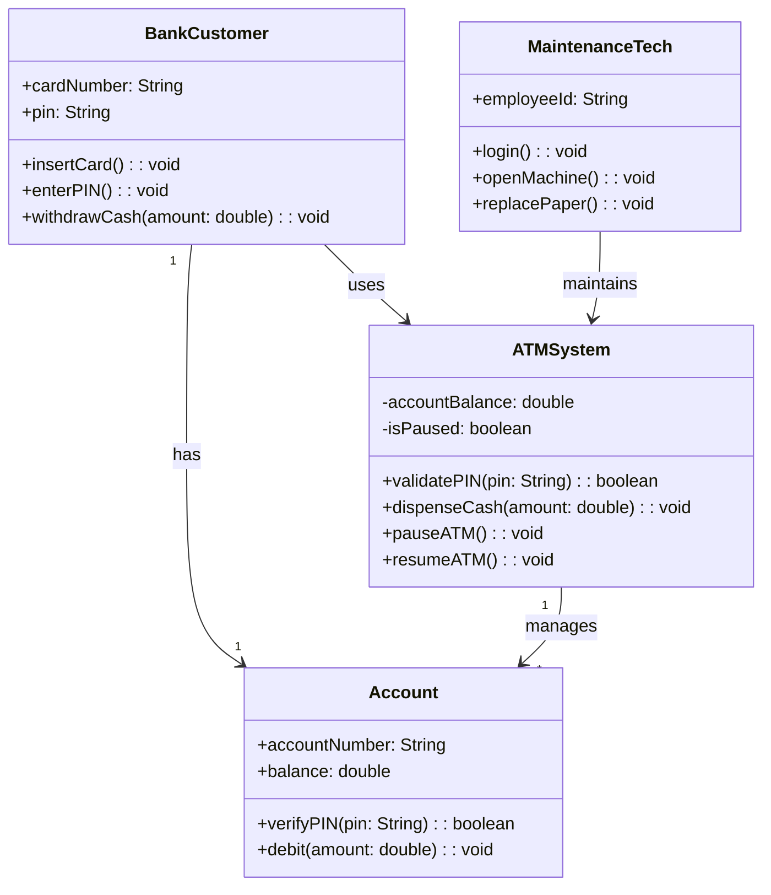
```mermaid
classDiagram
    class ATMSystem {
        +validatePIN(pin: String): boolean
        +dispenseCash(amount: double): void
        +pauseATM(): void
        +resumeATM(): void
        -accountBalance: double
        -isPaused: boolean
    }
    
    class BankCustomer {
        +cardNumber: String
        +pin: String
        +insertCard(): void
        +enterPIN(): void
        +withdrawCash(amount: double): void
    }
    
    class MaintenanceTech {
        +employeeId: String
        +login(): void
        +openMachine(): void
        +replacePaper(): void
    }
    
    class Account {
        +accountNumber: String
        +balance: double
        +verifyPIN(pin: String): boolean
        +debit(amount: double): void
    }
    
    BankCustomer "1" --> "1" Account : has
    BankCustomer --> ATMSystem : uses
    MaintenanceTech --> ATMSystem : maintains
    ATMSystem "1" --> "*" Account : manages
```

**4. Sequence Diagram (Corrected - Withdraw Cash):**
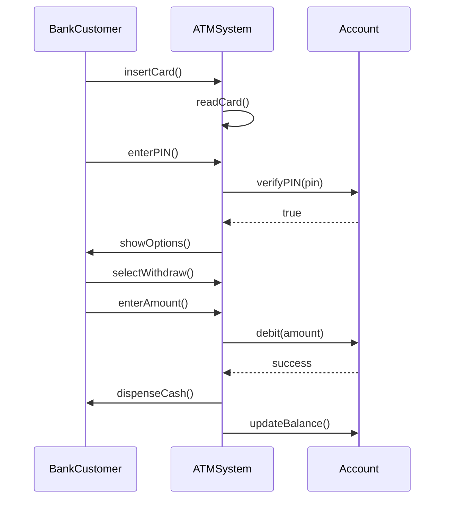
```mermaid
sequenceDiagram
    participant Customer as BankCustomer
    participant ATM as ATMSystem
    participant Account as Account
    
    Customer->>ATM: insertCard()
    ATM->>ATM: readCard()
    Customer->>ATM: enterPIN()
    ATM->>Account: verifyPIN(pin)
    Account-->>ATM: true
    ATM->>Customer: showOptions()
    Customer->>ATM: selectWithdraw()
    Customer->>ATM: enterAmount()
    ATM->>Account: debit(amount)
    Account-->>ATM: success
    ATM->>Customer: dispenseCash()
    ATM->>Account: updateBalance()
```

**5. Sequence Diagram (Corrected - Change Paper):**
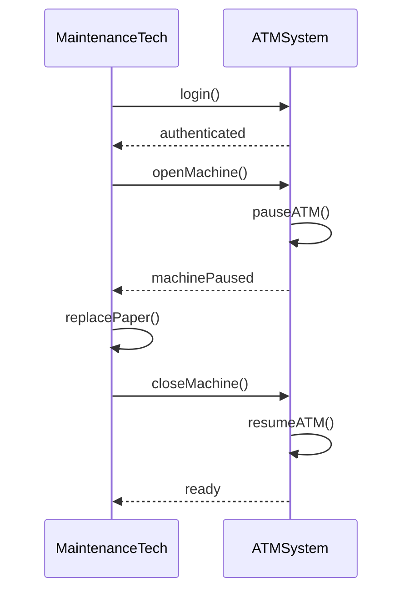
```mermaid
sequenceDiagram
    participant Tech as MaintenanceTech
    participant ATM as ATMSystem
    
    Tech->>ATM: login()
    ATM-->>Tech: authenticated
    Tech->>ATM: openMachine()
    ATM->>ATM: pauseATM()
    ATM-->>Tech: machinePaused
    Tech->>Tech: replacePaper()
    Tech->>ATM: closeMachine()
    ATM->>ATM: resumeATM()
    ATM-->>Tech: ready
```

---

## 📝 Assignment 2: University Portal (3 Use Cases)
**Focus Area:** Actor Mismatch & Extra SSD Messages

**1. Case Study (Scenario):**
> "A **Student** registers for a course through the University Portal. The system checks seat availability. A **Professor** can grade a student, and an **Admin** can add a new course to the system."

**2. Intentionally Faulty Submission (To be entered by student):**
*   **System Name:** `University Portal`
*   **Actors:** `Student`, `Professor`, `Admin`
*   **Use Cases (3):** `Register Course`, `Grade Student`, `Add Course`

*   **Use Case Descriptions (3):**
    *   **Description 1 (Register Course):**
        *   **Primary Actor:** `Studentt` *(Trigger: Actor Mismatch Error - spelling mistake in description vs diagram)*
        *   **Precondition:** `The student must be logged in.`
        *   **Postcondition:** `The course is registered.`
        *   **Main Flow:**
            1. Student selects a course.
            2. System verifies available seats.
            3. System registers the student.
    *   **Description 2 (Grade Student):**
        *   **Primary Actor:** `Professor`
        *   **Precondition:** `Professor is assigned to the course.`
        *   **Postcondition:** `Grade is submitted.`
        *   **Main Flow:**
            1. Professor selects student.
            2. System shows record.
            3. Professor submits grade.
    *   **Description 3 (Add Course):**
        *   **Primary Actor:** `Admin`
        *   **Precondition:** `Admin has privileges.`
        *   **Postcondition:** `Course is catalogued.`
        *   **Main Flow:**
            1. Admin enters course details.
            2. System saves course.

*   **System Sequence Diagrams (3):**
    *   **SSD 1 (Register Course):** Messages: `selectCourse()`, `verifySeats()`, `notifyFailure()` *(Trigger: Consistency Checker Error - `notifyFailure` is an extra message not present in the Main Flow)*
    *   **SSD 2 (Grade Student):** Messages: `selectStudent()`, `showRecord()`, `submitGrade()`
    *   **SSD 3 (Add Course):** Messages: `enterDetails()`, `saveCourse()`

**3. Class Diagram (Corrected):**
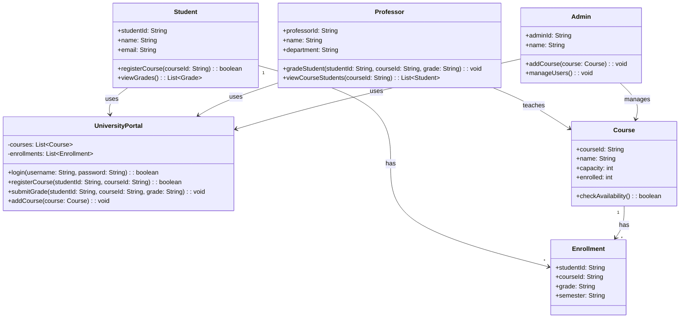
```mermaid
classDiagram
    class UniversityPortal {
        +login(username: String, password: String): boolean
        +registerCourse(studentId: String, courseId: String): boolean
        +submitGrade(studentId: String, courseId: String, grade: String): void
        +addCourse(course: Course): void
        -courses: List~Course~
        -enrollments: List~Enrollment~
    }
    
    class Student {
        +studentId: String
        +name: String
        +email: String
        +registerCourse(courseId: String): boolean
        +viewGrades(): List~Grade~
    }
    
    class Professor {
        +professorId: String
        +name: String
        +department: String
        +gradeStudent(studentId: String, courseId: String, grade: String): void
        +viewCourseStudents(courseId: String): List~Student~
    }
    
    class Admin {
        +adminId: String
        +name: String
        +addCourse(course: Course): void
        +manageUsers(): void
    }
    
    class Course {
        +courseId: String
        +name: String
        +capacity: int
        +enrolled: int
        +checkAvailability(): boolean
    }
    
    class Enrollment {
        +studentId: String
        +courseId: String
        +grade: String
        +semester: String
    }
    
    Student "1" --> "*" Enrollment : has
    Course "1" --> "*" Enrollment : has
    Professor --> Course : teaches
    Admin --> Course : manages
    Student --> UniversityPortal : uses
    Professor --> UniversityPortal : uses
    Admin --> UniversityPortal : uses
```

**4. Sequence Diagram (Corrected - Register Course):**
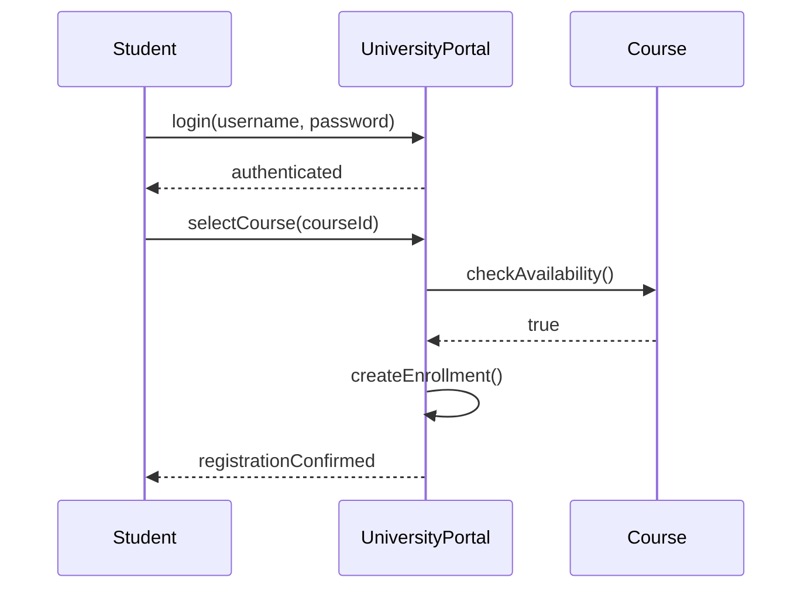
```mermaid
sequenceDiagram
    participant Student as Student
    participant Portal as UniversityPortal
    participant Course as Course
    
    Student->>Portal: login(username, password)
    Portal-->>Student: authenticated
    Student->>Portal: selectCourse(courseId)
    Portal->>Course: checkAvailability()
    Course-->>Portal: true
    Portal->>Portal: createEnrollment()
    Portal-->>Student: registrationConfirmed
```

**5. Sequence Diagram (Corrected - Grade Student):**
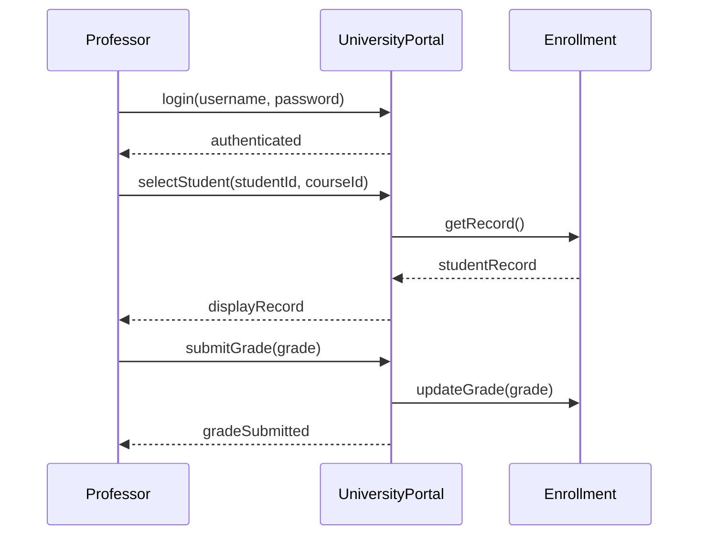
```mermaid
sequenceDiagram
    participant Professor as Professor
    participant Portal as UniversityPortal
    participant Enrollment as Enrollment
    
    Professor->>Portal: login(username, password)
    Portal-->>Professor: authenticated
    Professor->>Portal: selectStudent(studentId, courseId)
    Portal->>Enrollment: getRecord()
    Enrollment-->>Portal: studentRecord
    Portal-->>Professor: displayRecord
    Professor->>Portal: submitGrade(grade)
    Portal->>Enrollment: updateGrade(grade)
    Portal-->>Professor: gradeSubmitted
```

**6. Sequence Diagram (Corrected - Add Course):**
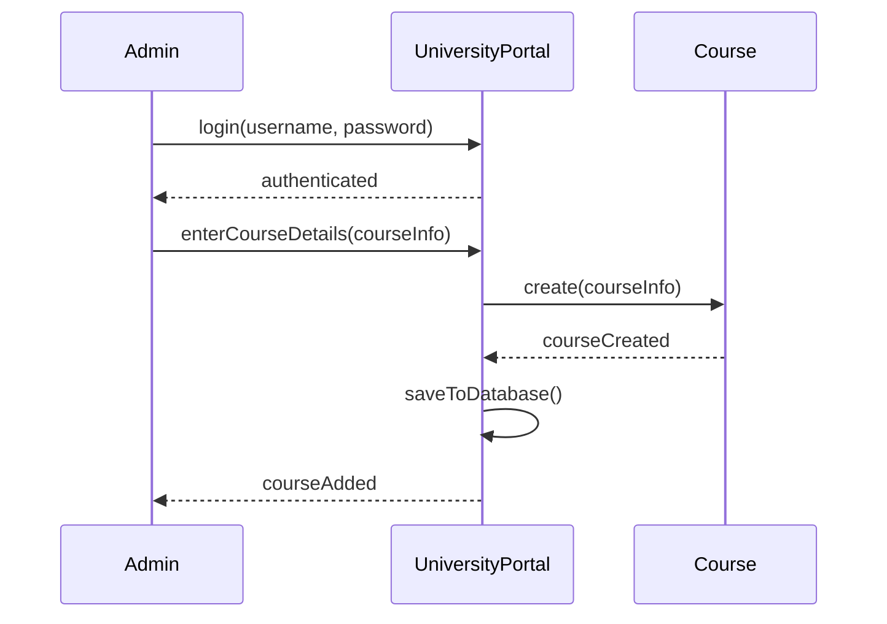
```mermaid
sequenceDiagram
    participant Admin as Admin
    participant Portal as UniversityPortal
    participant Course as Course
    
    Admin->>Portal: login(username, password)
    Portal-->>Admin: authenticated
    Admin->>Portal: enterCourseDetails(courseInfo)
    Portal->>Course: create(courseInfo)
    Course-->>Portal: courseCreated
    Portal->>Portal: saveToDatabase()
    Portal-->>Admin: courseAdded
```

---

## 📝 Assignment 3: E-Commerce Store (5 Use Cases)
**Focus Area:** Missing Steps & Chronological Order Mismatch

**1. Case Study (Scenario):**
> "An Online **Shopper** buys a product, views the catalog, and tracks orders. The **Seller** manages the inventory and processes refunds."

**2. Intentionally Faulty Submission (To be entered by student):**
*   **System Name:** `E-Commerce App`
*   **Actors:** `Shopper`, `Seller`
*   **Use Cases (5):** `Purchase Product`, `View Catalog`, `Track Order`, `Manage Inventory`, `Process Refund`

**Use Case Descriptions (Corrected):**
1. Purchase Product
   - Primary Actor: Shopper
   - Precondition: Cart is not empty; Shopper is logged in
   - Postcondition: Order is placed successfully with a unique order ID
   - Main Flow:
     - Shopper adds item to cart
     - Shopper enters shipping details
     - System calculates total
     - Shopper confirms payment
     - System generates order ID

2. View Catalog
   - Primary Actor: Shopper
   - Precondition: Shopper is logged in or guest access enabled
   - Postcondition: Catalog results are displayed
   - Main Flow:
     - Shopper searches item
     - System displays results

3. Track Order
   - Primary Actor: Shopper
   - Precondition: Shopper has a valid order ID
   - Postcondition: Order status is displayed
   - Main Flow:
     - Shopper enters order ID
     - System shows order status

4. Manage Inventory
   - Primary Actor: Seller
   - Precondition: Seller is authenticated
   - Postcondition: Inventory database updated successfully
   - Main Flow:
     - Seller updates stock
     - System confirms update

5. Process Refund
   - Primary Actor: Seller
   - Precondition: Refund request exists and is valid
   - Postcondition: Refund processed successfully
   - Main Flow:
     - Seller approves refund
     - System processes refund

**3. Class Diagram (Corrected):**
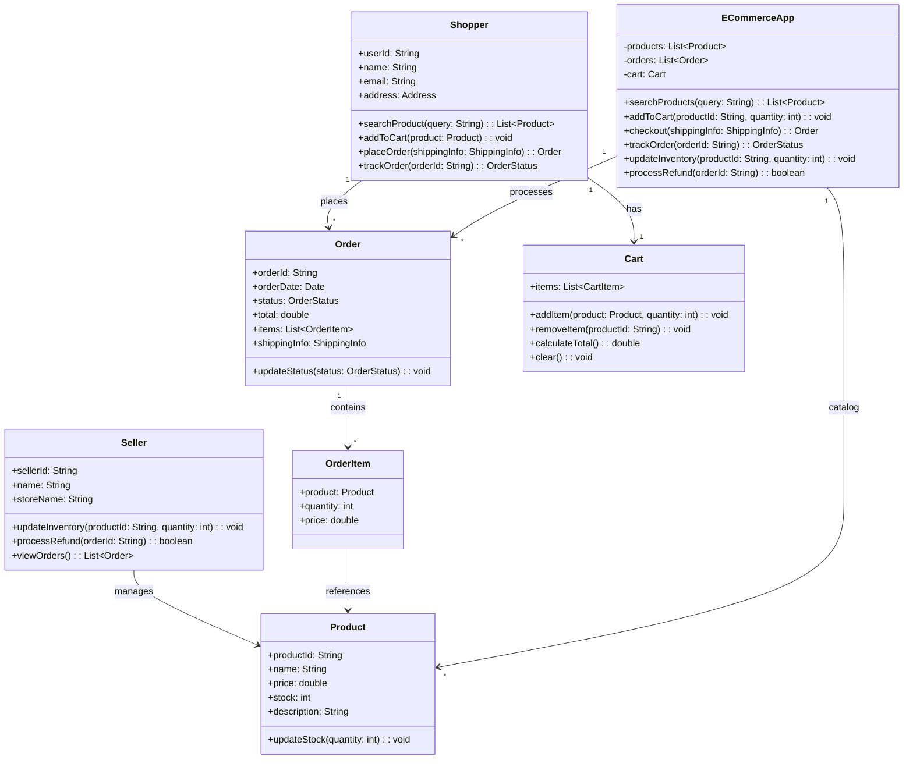
```mermaid
classDiagram
    class ECommerceApp {
        +searchProducts(query: String): List~Product~
        +addToCart(productId: String, quantity: int): void
        +checkout(shippingInfo: ShippingInfo): Order
        +trackOrder(orderId: String): OrderStatus
        +updateInventory(productId: String, quantity: int): void
        +processRefund(orderId: String): boolean
        -products: List~Product~
        -orders: List~Order~
        -cart: Cart
    }
    
    class Shopper {
        +userId: String
        +name: String
        +email: String
        +address: Address
        +searchProduct(query: String): List~Product~
        +addToCart(product: Product): void
        +placeOrder(shippingInfo: ShippingInfo): Order
        +trackOrder(orderId: String): OrderStatus
    }
    
    class Seller {
        +sellerId: String
        +name: String
        +storeName: String
        +updateInventory(productId: String, quantity: int): void
        +processRefund(orderId: String): boolean
        +viewOrders(): List~Order~
    }
    
    class Product {
        +productId: String
        +name: String
        +price: double
        +stock: int
        +description: String
        +updateStock(quantity: int): void
    }
    
    class Order {
        +orderId: String
        +orderDate: Date
        +status: OrderStatus
        +total: double
        +items: List~OrderItem~
        +shippingInfo: ShippingInfo
        +updateStatus(status: OrderStatus): void
    }
    
    class OrderItem {
        +product: Product
        +quantity: int
        +price: double
    }
    
    class Cart {
        +items: List~CartItem~
        +addItem(product: Product, quantity: int): void
        +removeItem(productId: String): void
        +calculateTotal(): double
        +clear(): void
    }
    
    Shopper "1" --> "*" Order : places
    Shopper "1" --> "1" Cart : has
    Seller --> Product : manages
    Order "1" --> "*" OrderItem : contains
    OrderItem --> Product : references
    ECommerceApp "1" --> "*" Product : catalog
    ECommerceApp "1" --> "*" Order : processes
```

**4. Sequence Diagram (Corrected - Purchase Product):**
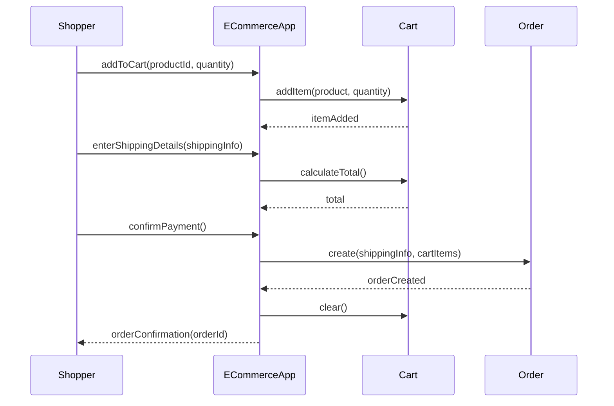
```mermaid
sequenceDiagram
    participant Shopper as Shopper
    participant App as ECommerceApp
    participant Cart as Cart
    participant Order as Order
    
    Shopper->>App: addToCart(productId, quantity)
    App->>Cart: addItem(product, quantity)
    Cart-->>App: itemAdded
    Shopper->>App: enterShippingDetails(shippingInfo)
    App->>Cart: calculateTotal()
    Cart-->>App: total
    Shopper->>App: confirmPayment()
    App->>Order: create(shippingInfo, cartItems)
    Order-->>App: orderCreated
    App->>Cart: clear()
    App-->>Shopper: orderConfirmation(orderId)
```

**5. Sequence Diagram (Corrected - View Catalog):**
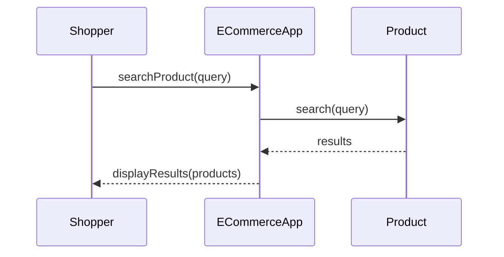
```mermaid
sequenceDiagram
    participant Shopper as Shopper
    participant App as ECommerceApp
    participant Product as Product
    
    Shopper->>App: searchProduct(query)
    App->>Product: search(query)
    Product-->>App: results
    App-->>Shopper: displayResults(products)
```

**6. Sequence Diagram (Corrected - Track Order):**
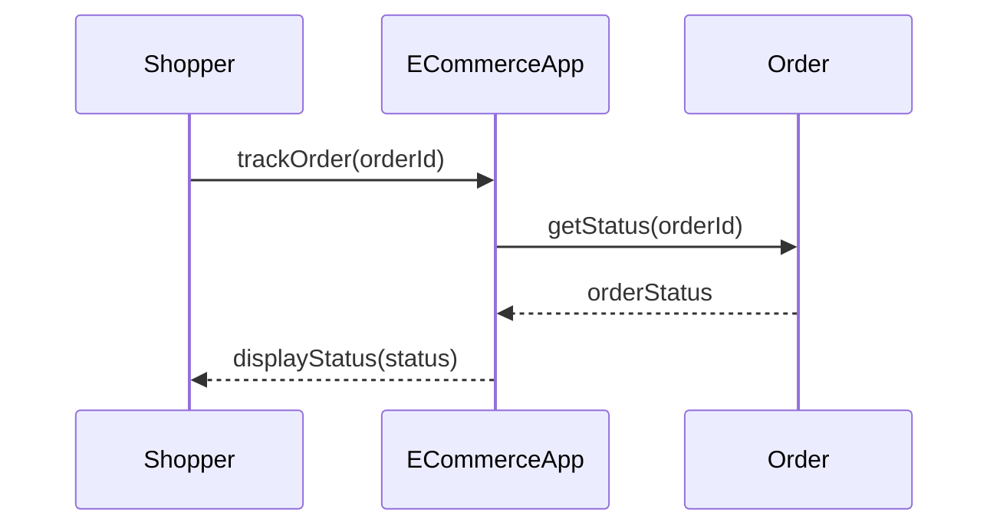
```mermaid
sequenceDiagram
    participant Shopper as Shopper
    participant App as ECommerceApp
    participant Order as Order
    
    Shopper->>App: trackOrder(orderId)
    App->>Order: getStatus(orderId)
    Order-->>App: orderStatus
    App-->>Shopper: displayStatus(status)
```

**7. Sequence Diagram (Corrected - Manage Inventory):**
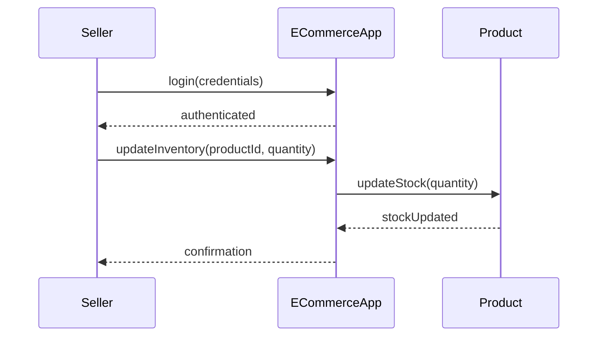
```mermaid
sequenceDiagram
    participant Seller as Seller
    participant App as ECommerceApp
    participant Product as Product
    
    Seller->>App: login(credentials)
    App-->>Seller: authenticated
    Seller->>App: updateInventory(productId, quantity)
    App->>Product: updateStock(quantity)
    Product-->>App: stockUpdated
    App-->>Seller: confirmation
```

**8. Sequence Diagram (Corrected - Process Refund):**
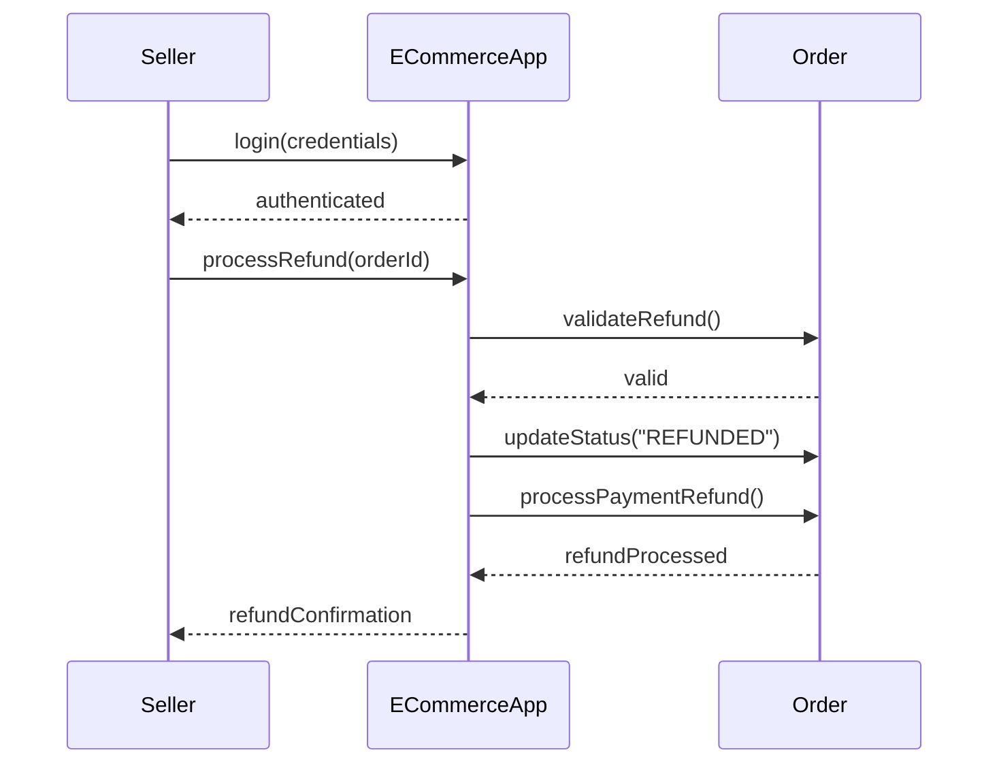
```mermaid
sequenceDiagram
    participant Seller as Seller
    participant App as ECommerceApp
    participant Order as Order
    
    Seller->>App: login(credentials)
    App-->>Seller: authenticated
    Seller->>App: processRefund(orderId)
    App->>Order: validateRefund()
    Order-->>App: valid
    App->>Order: updateStatus("REFUNDED")
    App->>Order: processPaymentRefund()
    Order-->>App: refundProcessed
    App-->>Seller: refundConfirmation
```

---

## 📝 Assignment 4: Hospital System (4 Use Cases)
**Focus Area:** Structural Errors & Empty Flow Steps

**1. Case Study (Scenario):**
> "A **Patient** books or cancels an appointment. A **Receptionist** is required but missing from action. A **Doctor** views patient history and prescribes medicine."

**2. Intentionally Faulty Submission (To be entered by student):**
*   **System Name:** `Hospital System`
*   **Actors:** `Patient`, `Receptionist`, `Doctor`
*   **Diagram Error:** Do not connect the `Receptionist` actor to any Use Case. *(Trigger: Actor Not Connected Error)*
*   **Use Cases (4):** `Book Appointment`, `Cancel Appointment`, `View History`, `Prescribe Medicine`

**Use Case Descriptions (Corrected):**
1. Book Appointment
   - Primary Actor: Patient
   - Precondition: Patient is registered in the system
   - Postcondition: Appointment slot confirmed and stored in database
   - Main Flow:
     - Patient requests appointment
     - Receptionist checks availability
     - System confirms slot

2. Cancel Appointment
   - Primary Actor: Patient
   - Precondition: Patient has an existing appointment
   - Postcondition: Appointment canceled and database updated
   - Main Flow:
     - Patient requests cancellation
     - Receptionist verifies request
     - System updates database

3. View History
   - Primary Actor: Doctor
   - Precondition: Patient record exists in system
   - Postcondition: Patient history displayed to doctor
   - Main Flow:
     - Doctor enters patient ID
     - System shows records

4. Prescribe Medicine
   - Primary Actor: Doctor
   - Precondition: Patient record is accessible
   - Postcondition: Prescription saved in system
   - Main Flow:
     - Doctor adds prescription
     - System saves prescription

**3. Class Diagram (Corrected):**
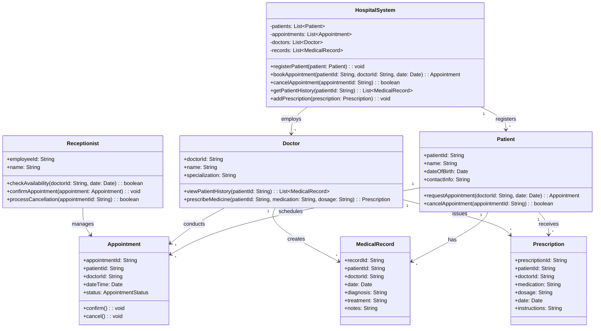
```mermaid
classDiagram
    class HospitalSystem {
        +registerPatient(patient: Patient): void
        +bookAppointment(patientId: String, doctorId: String, date: Date): Appointment
        +cancelAppointment(appointmentId: String): boolean
        +getPatientHistory(patientId: String): List~MedicalRecord~
        +addPrescription(prescription: Prescription): void
        -patients: List~Patient~
        -appointments: List~Appointment~
        -doctors: List~Doctor~
        -records: List~MedicalRecord~
    }
    
    class Patient {
        +patientId: String
        +name: String
        +dateOfBirth: Date
        +contactInfo: String
        +requestAppointment(doctorId: String, date: Date): Appointment
        +cancelAppointment(appointmentId: String): boolean
    }
    
    class Receptionist {
        +employeeId: String
        +name: String
        +checkAvailability(doctorId: String, date: Date): boolean
        +confirmAppointment(appointment: Appointment): void
        +processCancellation(appointmentId: String): boolean
    }
    
    class Doctor {
        +doctorId: String
        +name: String
        +specialization: String
        +viewPatientHistory(patientId: String): List~MedicalRecord~
        +prescribeMedicine(patientId: String, medication: String, dosage: String): Prescription
    }
    
    class Appointment {
        +appointmentId: String
        +patientId: String
        +doctorId: String
        +dateTime: Date
        +status: AppointmentStatus
        +confirm(): void
        +cancel(): void
    }
    
    class MedicalRecord {
        +recordId: String
        +patientId: String
        +doctorId: String
        +date: Date
        +diagnosis: String
        +treatment: String
        +notes: String
    }
    
    class Prescription {
        +prescriptionId: String
        +patientId: String
        +doctorId: String
        +medication: String
        +dosage: String
        +date: Date
        +instructions: String
    }
    
    Patient "1" --> "*" Appointment : schedules
    Doctor "1" --> "*" Appointment : conducts
    Patient "1" --> "*" MedicalRecord : has
    Doctor "1" --> "*" MedicalRecord : creates
    Patient "1" --> "*" Prescription : receives
    Doctor "1" --> "*" Prescription : issues
    Receptionist --> Appointment : manages
    HospitalSystem "1" --> "*" Patient : registers
    HospitalSystem "1" --> "*" Doctor : employs
```

**4. Sequence Diagram (Corrected - Book Appointment):**
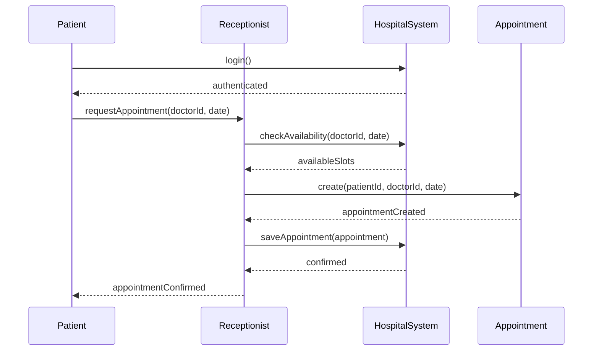
```mermaid
sequenceDiagram
    participant Patient as Patient
    participant Receptionist as Receptionist
    participant System as HospitalSystem
    participant Appointment as Appointment
    
    Patient->>System: login()
    System-->>Patient: authenticated
    Patient->>Receptionist: requestAppointment(doctorId, date)
    Receptionist->>System: checkAvailability(doctorId, date)
    System-->>Receptionist: availableSlots
    Receptionist->>Appointment: create(patientId, doctorId, date)
    Appointment-->>Receptionist: appointmentCreated
    Receptionist->>System: saveAppointment(appointment)
    System-->>Receptionist: confirmed
    Receptionist-->>Patient: appointmentConfirmed
```

**5. Sequence Diagram (Corrected - Cancel Appointment):**
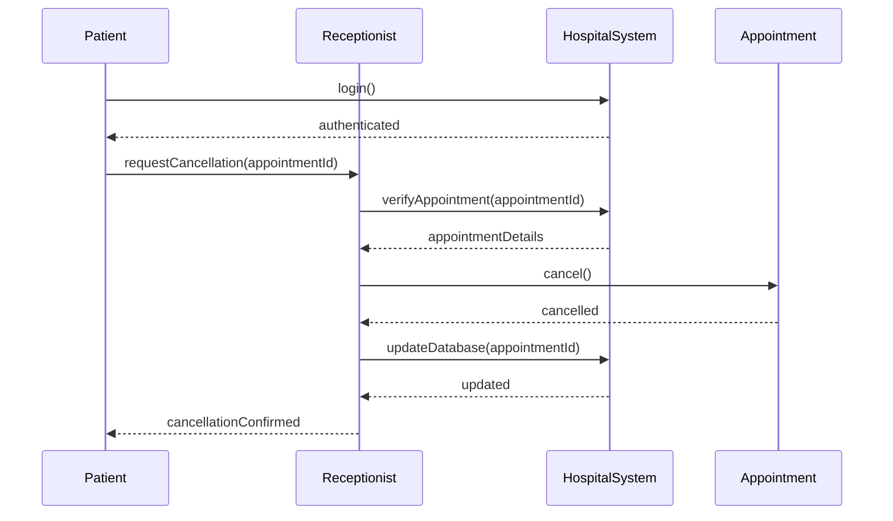
```mermaid
sequenceDiagram
    participant Patient as Patient
    participant Receptionist as Receptionist
    participant System as HospitalSystem
    participant Appointment as Appointment
    
    Patient->>System: login()
    System-->>Patient: authenticated
    Patient->>Receptionist: requestCancellation(appointmentId)
    Receptionist->>System: verifyAppointment(appointmentId)
    System-->>Receptionist: appointmentDetails
    Receptionist->>Appointment: cancel()
    Appointment-->>Receptionist: cancelled
    Receptionist->>System: updateDatabase(appointmentId)
    System-->>Receptionist: updated
    Receptionist-->>Patient: cancellationConfirmed
```

**6. Sequence Diagram (Corrected - View History):**
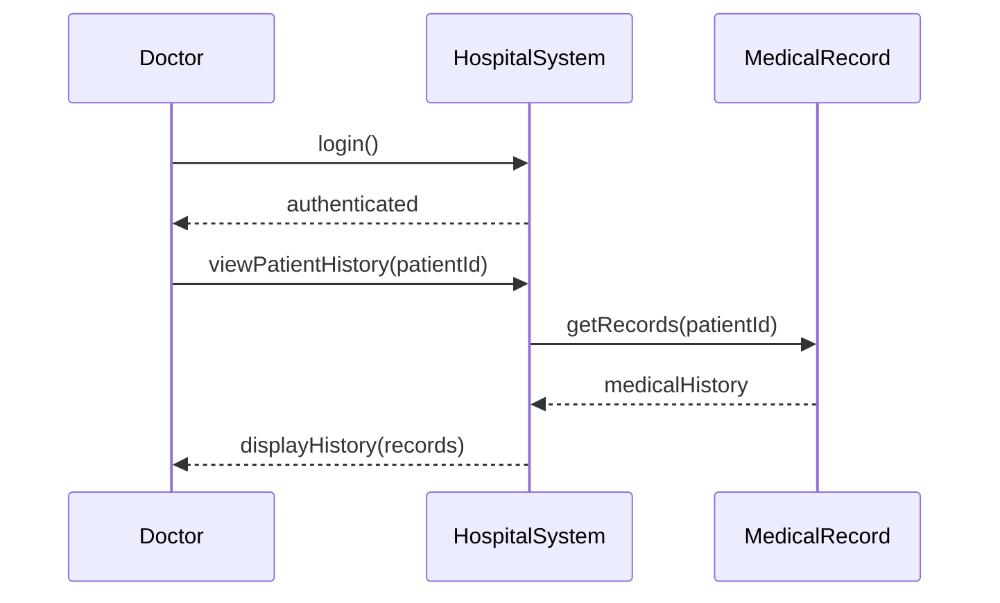
```mermaid
sequenceDiagram
    participant Doctor as Doctor
    participant System as HospitalSystem
    participant Record as MedicalRecord
    
    Doctor->>System: login()
    System-->>Doctor: authenticated
    Doctor->>System: viewPatientHistory(patientId)
    System->>Record: getRecords(patientId)
    Record-->>System: medicalHistory
    System-->>Doctor: displayHistory(records)
```

**7. Sequence Diagram (Corrected - Prescribe Medicine):**
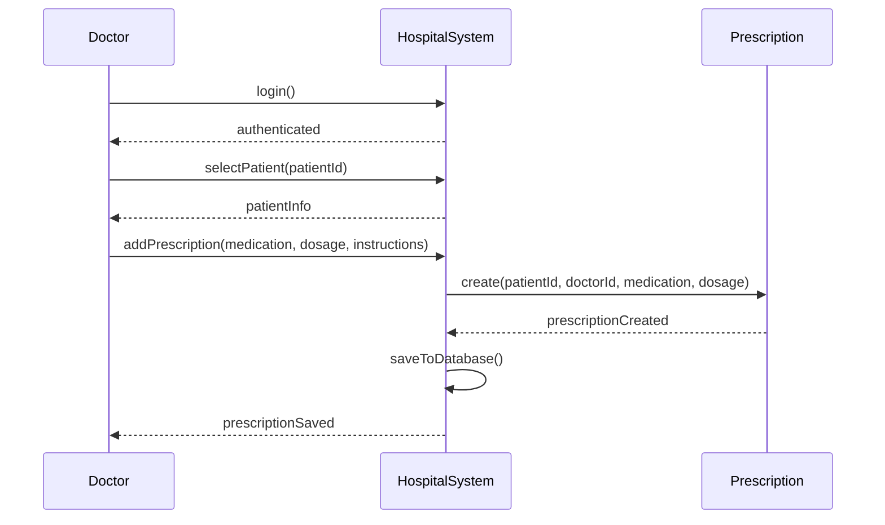
```mermaid
sequenceDiagram
    participant Doctor as Doctor
    participant System as HospitalSystem
    participant Prescription as Prescription
    
    Doctor->>System: login()
    System-->>Doctor: authenticated
    Doctor->>System: selectPatient(patientId)
    System-->>Doctor: patientInfo
    Doctor->>System: addPrescription(medication, dosage, instructions)
    System->>Prescription: create(patientId, doctorId, medication, dosage)
    Prescription-->>System: prescriptionCreated
    System->>System: saveToDatabase()
    System-->>Doctor: prescriptionSaved
```

---

## Summary of Test Manual Diagrams

This test manual now includes:

1. **Class Diagrams** for each system showing:
   - Classes and their attributes
   - Methods/operations
   - Relationships between classes (associations, aggregations, etc.)
   - Multiplicity indicators

2. **Sequence Diagrams** for each use case showing:
   - Lifelines for actors and system components
   - Message exchanges in chronological order
   - Activation bars showing processing time
   - Return messages

These diagrams serve as the correct reference implementations for students to compare against their submissions and understand proper UML modeling practices.